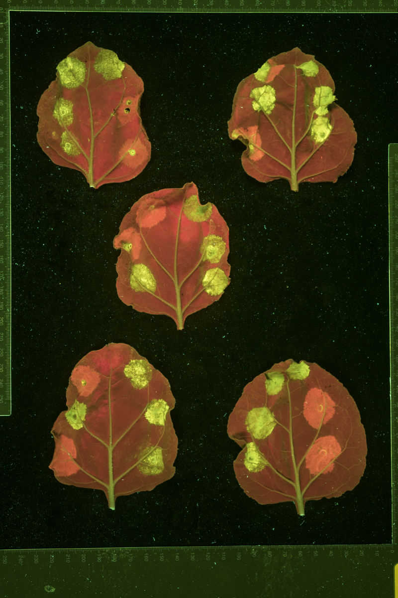

Date: 08/06/2026

## GOHREP

**Goal:**

Do pairwise scoring frequencies match our expectations given the image distribution strategy?

Are there differences in CDA counts per source agro image between different projects, and do those projects differ in how consistently they were scored?

**Hypothesis:**

In part 1 of the CDA dataset, raters will have collected fewer scores than expected. In part 2 of the dataset, they will match the expected number of scores collected.

There will be differences in CDA counts per source agro image, and in scoring agreement, between different projects.

**Rationale:**

Part 1 of the CDA dataset contains some dual-infiltration CDAs, which were ignored during scoring but not during source agro image distribution. Part 2 does not.

Different projects used different biological systems, different numbers of leaves per source image, and different numbers of infiltrations per leaf.

The image distribution strategy itself is documented separately in `01_generate_raw_data/01_allocation_info/image_distribution_strategy.qmd`.

## 1. Dual-infiltration images

Some images contained both yellow/green and orange CDAs ("dual-infiltration" images, see example below). The orange CDAs were ignored during scoring, but not during the source agro image allocation estimates. The dual-infiltration images are all from Project C and Project H (per `project_anonymisation_key.csv`'s `Dual_Infiltration` column).

{width="400"}

## 2. Setup

### 2.1 Load required packages

```{r}
#| output: false
# 2.1.1
library(readr)
library(ggplot2)
library(dplyr)
library(tidyr)
library(here)
```

```{r}
# 2.1.2
source(here("src", "data_helpers.R"))
source(here("src", "agreement_metrics.R"))
source(here("src", "plotting_helpers.R"))

save_plot <- make_save_plot("05_inter_rater_agreement")
```

### 2.2 Load data and add project columns

```{r}
# 2.2.1
# Paths
score1_path <- here(
  "analyses", "01_generate_raw_data", "03_checking_collected_coords", "combined_cda_data_checked_1.csv"
)
score2_path <- here(
  "analyses", "01_generate_raw_data", "03_checking_collected_coords", "combined_cda_data_checked_2.csv"
)
count_path <- here("analyses", "01_generate_raw_data", "01_allocation_info", "image_info.csv")
# Scorer columns (scorer1/2/3) are already anonymised IDs in this file - see
# the anonymisation script under scripts/.
alloc_path <- here("analyses", "01_generate_raw_data", "01_allocation_info", "randomised_info_anon.csv")

score_data_1 <- read_csv(score1_path, show_col_types = FALSE)
score_data_2 <- read_csv(score2_path, show_col_types = FALSE)
image_info <- read_csv(count_path, show_col_types = FALSE)
randomised_info <- read_csv(alloc_path, show_col_types = FALSE) %>%
  mutate(across(c(scorer1, scorer2, scorer3), as.character))

# Anonymised project labels (Project A, Project B, ...), shared key
project_key <- load_project_key()

# Project membership is taken from image_info.csv (authoritative), not from the
# allocation paths in randomised_info.csv, which mislabel some images. The Path
# column is recorded once per folder, so it is filled downwards; the top-level
# folder is the real project, which is then mapped to its anonymised label.
project_lookup <- setNames(project_key$Anon_Label, project_key$Project)
dual_lookup <- setNames(project_key$Dual_Infiltration, project_key$Anon_Label)

basename_to_folder <- image_info %>%
  fill(Path, .direction = "down") %>%
  mutate(Folder = unname(project_lookup[sub("/.*", "", Path)])) %>%
  select(Image, Folder) %>%
  {
    setNames(.$Folder, .$Image)
  }

count_data_1 <- image_info %>% filter(Set == 1)
count_data_2 <- image_info %>% filter(Set == 2)
allocation_data_1 <- randomised_info %>% filter(Set == 1)
allocation_data_2 <- randomised_info %>% filter(Set == 2)
```

Add `CDA_Per_Leaf`, `Folder` (project), and a `Dual_Infiltration` flag to the allocation data.

```{r}
# 2.2.2
new_columns <- function(allocation_data, count_data) {
  allocation_data$Path <- gsub(
    "^/Volumes/shared/Research-Groups/Mark-Banfield/Josh_Williams/", "", allocation_data$Path
  )

  merged_data <- merge(allocation_data, count_data, by.x = "basename", by.y = "Image", all.x = TRUE)
  merged_data <- merged_data[order(match(merged_data$basename, allocation_data$basename)), ]

  allocation_data$CDA_Per_Leaf <- merged_data$CDA_Per_Leaf
  # Project label taken from image_info (authoritative), keyed on the image basename
  allocation_data$Folder <- unname(basename_to_folder[allocation_data$basename])
  # Dual-infiltration projects (orange CDAs ignored during scoring)
  allocation_data$Dual_Infiltration <- unname(dual_lookup[allocation_data$Folder])

  allocation_data
}

allocation_data_1 <- new_columns(allocation_data_1, count_data_1)
allocation_data_2 <- new_columns(allocation_data_2, count_data_2)
allocation_data_combined <- rbind(allocation_data_1, allocation_data_2)
```

Convert to long form (one row per rater assignment). `ScorerName` is already
an anonymised ID (see 2.2.1).

```{r}
# 2.2.3
allocation_long <- function(allocation_data) {
  allocation_data %>%
    pivot_longer(cols = starts_with("scorer"), names_to = "Scorer", values_to = "ScorerName") %>%
    select(-Scorer, ScorerName, Dual_Infiltration, count, -Path, -index)
}

allocation_long_1 <- allocation_long(allocation_data_1)
allocation_long_2 <- allocation_long(allocation_data_2)
allocation_long_combined <- rbind(allocation_long_1, allocation_long_2)
```

### 2.3 Prepare long score tables and pairwise agreement

```{r}
# 2.3.1
score_long_1 <- long_score_table(score_data_1, include_median_score = FALSE)
score_long_2 <- long_score_table(score_data_2, include_median_score = FALSE)
score_long_combined <- rbind(score_long_1, score_long_2)
```

```{r}
# 2.3.2
merged_1 <- pairwise_score_data(score_long_1)
merged_2 <- pairwise_score_data(score_long_2)
```

## 3. CDA count per image by project

```{r fig.width=11, fig.height=10}
#| fig-width: 11
#| fig-height: 10
# 3
data_for_boxplots <- function(score_data, allocation_data) {
  score_data %>%
    left_join(allocation_data, by = c("Basename" = "basename")) %>%
    group_by(Folder, Basename) %>%
    summarise(RowCount = n(), .groups = "drop")
}

boxplot_data_1 <- data_for_boxplots(score_data_1, allocation_data_1)
boxplot_data_2 <- data_for_boxplots(score_data_2, allocation_data_2)
boxplot_data_combined <- rbind(boxplot_data_1, boxplot_data_2)

# Folder is needed per-CDA in later sections
score_long_combined <- score_long_combined %>%
  left_join(boxplot_data_combined %>% select(Basename, Folder), by = "Basename")

p <- ggplot(boxplot_data_combined, aes(x = Folder, y = RowCount)) +
  geom_boxplot(fill = "steelblue", alpha = 0.5, outlier.shape = NA) +
  geom_jitter(size = 2, alpha = 0.4, width = 0.2, color = "steelblue4") +
  labs(x = "Project", y = "CDA Count") +
  scale_y_continuous(limits = c(0, NA)) +
  theme_minimal() +
  theme(
    axis.text.x = element_text(angle = 45, hjust = 1),
    axis.text = element_text(size = 13),
    axis.title = element_text(size = 15),
    legend.title = element_text(size = 13),
    legend.text = element_text(size = 11)
  )
p
save_plot(p, "peragrobyproject.png", width = 11, height = 10)
```

## 4. Per-image agreement, size, and zeros by project

Per-image statistics (agreement with the median, CDA count, and proportion of 0s) computed from the canonical median dataset and coloured by project.

```{r}
# 4
median_path <- here("analyses", "01_generate_raw_data", "04_median_and_centre_coords", "combined_cda_data_median.csv")
median_long <- read_csv(median_path, show_col_types = FALSE) %>%
  select(Basename, Row, Col, Pos, Score1, Score2, Score3, Median_Score) %>%
  mutate(across(c(Score1, Score2, Score3), ~ replace(as.character(.), . == "[]", NA))) %>%
  pivot_longer(c(Score1, Score2, Score3), names_to = "num", values_to = "Score") %>%
  filter(!is.na(Score)) %>%
  mutate(Score = as.integer(Score))

folder_map <- allocation_data_combined %>% select(Basename = basename, Folder)

image_stats <- median_long %>%
  group_by(Basename) %>%
  summarise(
    Objects_Count = n_distinct(paste(Row, Col, Pos, sep = "_")),
    Avg_Percent_Agreement = mean(Score == Median_Score) * 100,
    Percent_0 = mean(Score == 0) * 100,
    .groups = "drop"
  ) %>%
  left_join(folder_map, by = "Basename")
```

### 4.1 Agreement with median per image

```{r fig.width=10, fig.height=6}
#| fig-width: 10
#| fig-height: 6
# 4.1
p <- ggplot(image_stats, aes(x = Avg_Percent_Agreement, fill = Folder)) +
  geom_histogram(binwidth = 5, boundary = 0, colour = "white") +
  scale_fill_brewer(palette = "Set1") +
  labs(x = "Average % Agreement with Median Severity Score", y = "Number of Images") +
  theme_minimal() +
  theme(
    axis.text = element_text(size = 13),
    axis.title = element_text(size = 15),
    legend.title = element_text(size = 13),
    legend.text = element_text(size = 11)
  )
p
save_plot(p, "agreement_by_image_by_project.png", width = 10, height = 6, dir = "thesis_plots")
```

**What this shows:**

- Most images had 75-95% agreement with the median, but some were as low as 40%.

### 4.2 CDA count per image

```{r fig.width=10, fig.height=6}
#| fig-width: 10
#| fig-height: 6
# 4.2
p <- ggplot(image_stats, aes(x = Objects_Count, fill = Folder)) +
  geom_histogram(binwidth = 10, boundary = 0, colour = "white") +
  scale_fill_brewer(palette = "Set1") +
  labs(x = "CDA Count per Image", y = "Number of Images") +
  theme_minimal() +
  theme(
    axis.text = element_text(size = 13),
    axis.title = element_text(size = 15),
    legend.title = element_text(size = 13),
    legend.text = element_text(size = 11)
  )
p
save_plot(p, "cda_count_per_image_by_project.png", width = 10, height = 6, dir = "thesis_plots")
```

**What this shows:**

- Image sizes vary widely, from a less than 10 CDAs to over 120.
- Most images had betwen 21-30 cell death areas.

### 4.3 Agreement vs proportion of 0s

```{r fig.width=10, fig.height=6}
#| fig-width: 10
#| fig-height: 6
# 4.3
p <- ggplot(image_stats, aes(x = Percent_0, y = Avg_Percent_Agreement, color = Folder)) +
  geom_point(alpha = 0.7, size = 2) +
  scale_color_brewer(palette = "Set1") +
  labs(x = "% of scores that were 0", y = "Average % Agreement with Median Severity Score") +
  theme_minimal() +
  theme(
    axis.text = element_text(size = 13),
    axis.title = element_text(size = 15),
    legend.title = element_text(size = 13),
    legend.text = element_text(size = 11)
  )
p
save_plot(p, "agreement_vs_zeros_by_project.png", width = 10, height = 6)
```

**What this shows:**

- Images dominated by 0s tend to have higher agreement with the median, and these cluster by project.

### 4.4 Average agreement with median per project (with 95% CI)

Aggregating the per-image agreement from §4.1 up to project level. Bars show the mean agreement per project (images as the unit of replication); error bars are the 95% CI (t-distribution, using each project's own image count); points are the individual per-image values, jittered.

```{r fig.width=10, fig.height=6}
#| fig-width: 10
#| fig-height: 6
# 4.4
project_agreement <- image_stats %>%
  group_by(Folder) %>%
  summarise(
    N        = n(),
    Mean     = mean(Avg_Percent_Agreement),
    SD       = sd(Avg_Percent_Agreement),
    SE       = SD / sqrt(N),
    CI_Lower = Mean - qt(0.975, df = N - 1) * SE,
    CI_Upper = Mean + qt(0.975, df = N - 1) * SE,
    .groups  = "drop"
  ) %>%
  arrange(desc(Mean))

project_agreement$Folder <- factor(project_agreement$Folder, levels = project_agreement$Folder)
image_stats_ord <- image_stats %>%
  mutate(Folder = factor(Folder, levels = levels(project_agreement$Folder)))

p <- ggplot(project_agreement, aes(x = Folder, y = Mean)) +
  geom_col(fill = "steelblue", alpha = 0.5, width = 0.6) +
  geom_jitter(
    data = image_stats_ord, aes(x = Folder, y = Avg_Percent_Agreement),
    inherit.aes = FALSE, width = 0.15, height = 0,
    alpha = 0.35, size = 1.4, color = "steelblue4"
  ) +
  geom_errorbar(aes(ymin = CI_Lower, ymax = CI_Upper), width = 0.2, linewidth = 0.7) +
  labs(x = "Project", y = "Average % Agreement with Median Severity Score") +
  ylim(0, 100) +
  theme_minimal() +
  theme(
    axis.text.x = element_text(angle = 45, hjust = 1),
    axis.text = element_text(size = 13),
    axis.title = element_text(size = 15)
  )
p
save_plot(p, "avg_agreement_with_median_by_project.png", width = 10, height = 6, dir = "thesis_plots")
```

**What this shows:**

- Projects B and G have the highest and most tightly estimated agreement with the median; Project H is a clear outlier on the low end.
- CIs are widest for the smallest projects (A, F — only 4 images each), so those means should be read cautiously.

## 5. Images per rater faceted by project

```{r fig.width=11, fig.height=10}
#| fig-width: 11
#| fig-height: 10
# 5
count_data <- allocation_long_combined %>%
  group_by(ScorerName, Folder) %>%
  summarise(row_count = n(), .groups = "drop") %>%
  complete(ScorerName, Folder, fill = list(row_count = 0))

count_data$ScorerName <- factor(count_data$ScorerName, levels = sort(as.numeric(unique(count_data$ScorerName))))
count_data$Folder <- factor(count_data$Folder, levels = sort(unique(count_data$Folder)))

p <- ggplot(count_data, aes(x = ScorerName, y = row_count, color = ScorerName)) +
  geom_point(size = 5) +
  facet_wrap(~Folder, scales = "free_y", nrow = 2) +
  scale_y_continuous(limits = c(min(count_data$row_count), max(count_data$row_count))) +
  labs(x = "Rater", y = "Agroinfiltration Image Count", color = "Rater ID") +
  theme_minimal() +
  theme(
    text         = element_text(size = 20),
    strip.text   = element_text(size = 20),
    axis.text    = element_text(size = 13),
    axis.title   = element_text(size = 15),
    legend.title = element_text(size = 13),
    legend.text  = element_text(size = 11)
  )
p
save_plot(p, "projectalloc.png", width = 12, height = 6, dir = "thesis_plots")
```

## 6. Average pairwise agreement per project

```{r}
# 6.1
avg_agreements <- c()
counts <- c()
zero_count <- c()
unique_folders <- unique(score_long_combined$Folder)

for (folder in unique_folders) {
  score_long_subset <- score_long_combined %>% filter(Folder == folder)
  pair_merged <- pairwise_score_data(score_long_subset)
  avg_agreements <- c(avg_agreements, average_pairwise_agreement(pair_merged))
  counts <- c(counts, nrow(score_long_subset))
  zero_count <- c(zero_count, nrow(score_long_subset %>% filter(Score == 0)))
}

results_df <- data.frame(
  Folder = unique_folders,
  Average_Agreement = avg_agreements,
  Count = counts,
  Zero_Proportion = zero_count / counts
)
knitr::kable(results_df, digits = 2)
```

```{r fig.width=11, fig.height=10}
#| fig-width: 11
#| fig-height: 10
# 6.2
p <- ggplot(results_df, aes(x = Folder, y = Average_Agreement, size = Count, color = Count)) +
  geom_point() +
  scale_size_continuous(range = c(2, 40)) +
  scale_color_gradient(low = "cornflowerblue", high = "firebrick") +
  labs(x = "Project", y = "Average Agreement", size = "Total Score Count (area)", color = "") +
  ylim(0, 100) +
  theme_minimal() +
  theme(
    axis.text.x = element_text(angle = 45, hjust = 1),
    axis.text = element_text(size = 13),
    axis.title = element_text(size = 15),
    legend.title = element_text(size = 13),
    legend.text = element_text(size = 11)
  )
p
save_plot(p, "avg_pairwise_agreement_by_project.png", width = 11, height = 10)
```

The average agreement per project ties directly into the agreement vs proportion-of-0s plot in §4.3.

## 7. Expected vs actual CDA counts

### 7.1 Estimated vs actual CDAs per source image

```{r fig.width=11, fig.height=10}
#| fig-width: 11
#| fig-height: 10
# 7.1
basename_counts <- score_long_combined %>%
  group_by(Basename) %>%
  summarise(actual_count = n(), .groups = "drop")

combined_data <- basename_counts %>%
  left_join(allocation_data_combined, by = c("Basename" = "basename")) %>%
  select(Basename, actual_count, expected_count = count, Folder) %>%
  mutate(expected_count = expected_count * 3)

p <- ggplot(combined_data, aes(x = actual_count, y = expected_count, color = Folder)) +
  geom_point(size = 5, alpha = 0.3) +
  geom_abline(slope = 1, intercept = 0, linetype = "dashed", color = "red") +
  labs(x = "Actual Count", y = "Expected Count", color = "Project") +
  scale_color_brewer(palette = "Set1") +
  guides(color = guide_legend(override.aes = list(alpha = 1))) +
  theme_minimal() +
  theme(
    axis.text = element_text(size = 13),
    axis.title = element_text(size = 15),
    legend.title = element_text(size = 13),
    legend.text = element_text(size = 11)
  )
p
save_plot(p, "expectedvsactual.png", width = 11, height = 10)
```

### 7.2 Expected count per rater pair (assumes no dual-infiltration)

```{r fig.width=7, fig.height=6}
#| fig-width: 7
#| fig-height: 6
# 7.2
expected_1 <- (2 / length(unique(merged_1$Scorer.y))) * nrow(score_data_1)
expected_2 <- (2 / length(unique(merged_2$Scorer.y))) * nrow(score_data_2)

pairwise_combined <- bind_rows(
  merged_1 %>% mutate(Set = "Set 1"),
  merged_2 %>% mutate(Set = "Set 2")
) %>%
  filter(!is.na(Total))

set_levels <- c("Set 1", "Set 2")
expected_df <- data.frame(Set = set_levels, Expected = c(expected_1, expected_2)) %>%
  mutate(x_pos = as.numeric(factor(Set, levels = set_levels)))

p <- ggplot(pairwise_combined, aes(x = Set, y = Total)) +
  geom_point(
    color = "steelblue", size = 3, alpha = 0.6,
    position = position_jitter(width = 0.1, height = 0)
  ) +
  geom_segment(
    data = expected_df,
    aes(
      x = x_pos - 0.4, xend = x_pos + 0.4,
      y = Expected, yend = Expected,
      linetype = "Expected (no dual-infiltration)"
    ),
    color = "firebrick", linewidth = 1, inherit.aes = FALSE
  ) +
  scale_linetype_manual(name = NULL, values = c("Expected (no dual-infiltration)" = "dashed")) +
  scale_x_discrete(limits = set_levels) +
  scale_y_continuous(limits = c(0, NA)) +
  labs(x = "Dataset", y = "CDA Count per Rater Pair") +
  theme_minimal() +
  theme(
    axis.text = element_text(size = 13),
    axis.title = element_text(size = 15),
    legend.title = element_text(size = 13),
    legend.text = element_text(size = 11)
  )
p
save_plot(p, "pairscorefreq.png", width = 7, height = 6)
```

The frequencies are below what we would expect.

## 8. Sensitivity analysis: removing projects

Each project is removed in turn (along with any two-rater CDAs that then disagree), and the overall pairwise agreement is recomputed.

```{r}
# 8.1
remove_project <- function(score_data_long, project, remove_2_disagree) {
  subset_score_data <- subset(score_data_long, Folder != project)

  if (remove_2_disagree == TRUE) {
    groups_with_issues <- subset_score_data %>%
      group_by(Basename, Row, Col, Pos) %>%
      filter(n() == 2) %>%
      mutate(diff_scores = n_distinct(Score) > 1) %>%
      filter(diff_scores) %>%
      ungroup() %>%
      select(Basename, Row, Col, Pos)

    subset_score_data <- subset_score_data %>%
      anti_join(groups_with_issues, by = c("Basename", "Row", "Col", "Pos"))
  }
  subset_score_data
}
```

```{r}
# 8.2
unique_projects <- c("Original", sort(unique(score_long_combined$Folder)))

CDA_count <- c()
avg_pairwise_agreement <- c()

for (project in unique_projects) {
  subset_score_data_T <- remove_project(score_long_combined, project, TRUE)

  num_unique_CDAs <- subset_score_data_T %>%
    group_by(Basename, Row, Col, Pos) %>%
    summarise(n = n(), .groups = "drop") %>%
    nrow()

  pairwise_avg_T <- average_pairwise_agreement(pairwise_score_data(subset_score_data_T))

  CDA_count <- c(CDA_count, num_unique_CDAs)
  avg_pairwise_agreement <- c(avg_pairwise_agreement, pairwise_avg_T)
}

result_df <- data.frame(
  Project_Removed = unique_projects,
  Score_Count = CDA_count,
  Avg_Pairwise_Agreement = avg_pairwise_agreement
)

original_agreement <- result_df$Avg_Pairwise_Agreement[result_df$Project_Removed == "Original"]

result_df <- result_df %>%
  mutate(Agreement_Change = ifelse(
    Project_Removed == "Original", "0",
    sprintf("%+.2f", Avg_Pairwise_Agreement - original_agreement)
  )) %>%
  arrange(desc(Avg_Pairwise_Agreement))

knitr::kable(result_df, digits = 2)
```

```{r fig.width=10, fig.height=6}
#| fig-width: 10
#| fig-height: 6
# 8.3
# Bar plot: absolute pairwise agreement when each project is removed, with bars
# drawn relative to the Original baseline. Ordered highest to lowest, labelled with
# the change vs Original.
bar_df <- result_df %>%
  filter(Project_Removed != "Original") %>%
  mutate(
    Delta = Avg_Pairwise_Agreement - original_agreement,
    Project_Removed = reorder(Project_Removed, -Delta)
  )
bar_df$xpos <- as.numeric(bar_df$Project_Removed)

p <- ggplot(bar_df) +
  geom_rect(aes(
    xmin = xpos - 0.4, xmax = xpos + 0.4,
    ymin = original_agreement, ymax = Avg_Pairwise_Agreement,
    fill = Delta > 0
  )) +
  geom_hline(yintercept = original_agreement, linewidth = 0.6) +
  geom_text(aes(
    x = xpos, y = Avg_Pairwise_Agreement, label = sprintf("%+.2f", Delta),
    vjust = ifelse(Delta > 0, -0.4, 1.3)
  ), size = 4) +
  scale_x_continuous(breaks = sort(bar_df$xpos), labels = levels(bar_df$Project_Removed)) +
  scale_y_continuous(
    expand = expansion(mult = c(0.1, 0.1)),
    sec.axis = sec_axis(~.,
      breaks = original_agreement,
      labels = sprintf("Original (%.1f%%)", original_agreement)
    )
  ) +
  scale_fill_manual(values = c("TRUE" = "firebrick", "FALSE" = "steelblue"), guide = "none") +
  labs(x = "Project removed", y = "Pairwise agreement (%)") +
  coord_cartesian(clip = "off") +
  theme_minimal() +
  theme(
    axis.text.x = element_text(angle = 45, hjust = 1),
    axis.text = element_text(size = 13),
    axis.title = element_text(size = 15),
    axis.text.y.right = element_text(face = "italic", colour = "grey35"),
    axis.ticks.y.right = element_line(colour = "grey35"),
    plot.margin = margin(12, 12, 5.5, 12)
  )
p
save_plot(p, "sensitivity_agreement_change.png", width = 10, height = 6, dir = "thesis_plots")
```

## 9. Score class distribution by project (heatmap)

Proportion of CDA severity classes (median score) within each project, mirroring the rater heatmap in `02_score_distributions.qmd` §3.2.

```{r fig.width=10, fig.height=7}
#| fig-width: 10
#| fig-height: 7
# 9
cda_folder <- median_long %>%
  distinct(Basename, Row, Col, Pos, Median_Score) %>%
  left_join(folder_map, by = "Basename")

class_pct <- cda_folder %>%
  count(Folder, Median_Score, name = "Count") %>%
  group_by(Folder) %>%
  mutate(Proportion = Count / sum(Count)) %>%
  ungroup()

folder_totals <- cda_folder %>%
  count(Folder, name = "Total")

folder_labels <- setNames(
  paste0(folder_totals$Folder, "\n(n=", folder_totals$Total, ")"),
  folder_totals$Folder
)

p <- ggplot(class_pct, aes(x = Folder, y = factor(Median_Score), fill = Proportion)) +
  geom_tile(color = "black") +
  geom_text(aes(label = sprintf("%.1f%%", Proportion * 100)), color = "black", size = 4.5) +
  scale_fill_gradient(name = "Proportion\n(within Project)", low = "white", high = "firebrick") +
  scale_x_discrete(labels = folder_labels) +
  coord_equal() +
  labs(x = "Project", y = "Median Severity Score") +
  theme_minimal() +
  theme(
    axis.text.x = element_text(angle = 45, hjust = 1),
    axis.text = element_text(size = 13),
    axis.title = element_text(size = 15),
    legend.title = element_text(size = 13),
    legend.text = element_text(size = 11)
  )
p
save_plot(p, "score_class_by_project_heatmap.png", width = 10, height = 7, dir = "thesis_plots")
```

## 10. Discussion

### 10.1 CDA count per image by project

_Add notes here._

### 10.2 Agreement with median per image

- Different images from different projects would involve different biological systems, different lighting conditions, and different score distributions, increasing or decreasing the simplicity of their scoring. They were also scored by different combinations of raters, some of whom would share more similar scoring biases than others.

### 10.3 CDA count per image

- The smallest images had just two leaves, each with 4 cell death areas (8 total). The largest had 16 leaves, each with 8 cell death areas (128 total).
- The majority of images had 5 leaves, each with 6 cell death areas (30 total), which explains the peak. Another subset had the same layout, but with each leaf having two of four orange cell death areas which were ignored (20 or 10 total), providing the second peak.

### 10.4 Agreement vs proportion of 0s

- 0s are the least ambiguous score, and some projects (biological systems) produce far more 0s than others.

### 10.5 Average agreement with median per project (with 95% CI)

_Add notes here._

### 10.6 Images per rater faceted by project

_Add notes here._

### 10.7 Average pairwise agreement per project

_Add notes here._

### 10.8 Estimated vs actual CDAs per source image

_Add notes here._

### 10.9 Expected count per rater pair

_Add notes here._

### 10.10 Sensitivity analysis: removing projects

_Add notes here._

### 10.11 Score class distribution by project

_Add notes here._

### 10.12 Overall narrative

_Add notes here._
